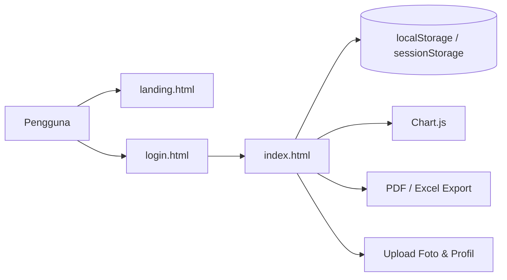

# SIMASRA — Sistem Informasi Monitoring & Manajemen Asrama Mahasiswa Kabupaten Deiyai

> Versi final dokumen proyek yang disesuaikan dengan isi aktual `index.html`, `landing.html`, `login.html`, dan `asset/js/script.js` pada workspace saat ini.

## 1. Ringkasan Proyek

SIMASRA adalah aplikasi web single-page application (SPA) berbasis browser untuk mengelola operasional Asrama Mahasiswa Kabupaten Deiyai di Kota Studi Jayapura. Aplikasi ini mencakup pengelolaan data penghuni, penempatan kamar/barak, presensi, izin keluar-masuk, pelanggaran, aktivitas asrama, inventaris, laporan, serta pengelolaan akun pengguna.

Semua fitur utama berjalan pada sisi klien (`client-side`) menggunakan Alpine.js, Tailwind CSS yang dibangun lokal (`asset/css/tailwind-output.css`), CSS kustom, dan penyimpanan lokal berbasis `localStorage`/`sessionStorage`. Proyek ini tidak memiliki backend atau database server, namun sudah mendukung upload foto penghuni/profil, sinkronisasi data real-time antar tab, serta manajemen dashboard operasional penuh di browser.

### Diagram Arsitektur Sistem



## 2. Teknologi yang Digunakan

| Komponen              | Teknologi / Library                     | Catatan                                                                                                |
| :-------------------- | :-------------------------------------- | :----------------------------------------------------------------------------------------------------- |
| UI & State Management | Alpine.js 3.x                           | Dipakai di `landing.html`, `login.html`, dan `index.html`                                              |
| Styling               | Tailwind CSS (build lokal) + custom CSS | `asset/css/tailwind-output.css`, `asset/css/style.css`, `asset/css/landing.css`, `asset/css/login.css` |
| Media / Foto          | Data URL gambar (base64)                | Foto penghuni dan foto profil disimpan dalam `localStorage` sebagai data URL gambar                    |
| Notifikasi & Dialog   | SweetAlert2                             | Digunakan di login dan dashboard                                                                       |
| QR Generator          | qrcodejs 1.0.0                          | Digunakan untuk kartu anggota                                                                          |
| QR Scanner            | html5-qrcode 2.3.8                      | Digunakan untuk presensi QR                                                                            |
| Chart                 | Chart.js 4.4.0                          | Grafik dashboard dan laporan                                                                           |
| Export Dokumen        | jsPDF + AutoTable + SheetJS             | Export PDF dan Excel                                                                                   |
| Storage               | localStorage / sessionStorage           | Penyimpanan data utama proyek                                                                          |
| Sinkronisasi Tab      | `storage` event                         | Sinkronisasi data antar tab browser                                                                    |

## 3. Struktur File Proyek

```text
ASDEY-Monitoring/
├── index.html                  # Dashboard utama SPA (semua modul operasional)
├── landing.html                # Landing page publik dan statistik awal
├── login.html                  # Halaman login, register, dan lupa sandi
├── README.md                   # Dokumentasi proyek
├── package.json                # Konfigurasi npm dan script build Tailwind
├── tailwind.config.js          # Konfigurasi Tailwind CSS build lokal
├── proposal_simasra.docx       # Dokumen proposal sistem
├── DFD-Level 1.jpg             # Diagram aliran data level 1
├── ERD.drawio.svg              # Diagram ERD vektor
├── ERD.jpg                     # Diagram ERD gambar
├── asset/
│   ├── css/
│   │   ├── landing.css         # Style halaman landing
│   │   ├── login.css          # Style halaman login
│   │   ├── style.css          # Style umum dashboard dan komponen UI
│   │   ├── tailwind-source.css # Entry CSS untuk Tailwind build lokal
│   │   └── tailwind-output.css # Hasil build Tailwind (generated CSS)
│   ├── img/
│   │   ├── bg-login.jpg       # Background halaman login
│   │   ├── logo-login.png     # Logo ASDEI
│   │   ├── logo-kabupaten.png # Logo Kabupaten Deiyai
│   │   ├── site.webmanifest   # Manifest PWA
│   │   └── ikon favicon / PWA lainnya
│   └── js/
│       └── script.js          # Logika utama aplikasi Alpine.js
├── node_modules/               # Dependency npm hasil install local (opsional)
└── .git/                      # Metadata repositori lokal
```

## 4. Role-Based Access Control (RBAC)

Akses modul pada dashboard dikendalikan oleh `currentRole` di `asset/js/script.js`.

| Role       | Akses yang aktif saat ini                                                                                             |
| :--------- | :-------------------------------------------------------------------------------------------------------------------- |
| `admin`    | `dashboard`, `penghuni`, `kamar`, `presensi`, `izin`, `pelanggaran`, `aktivitas`, `inventaris`, `laporan`, `pengguna` |
| `pembina`  | `dashboard`, `penghuni`, `kamar`, `presensi`, `izin`, `pelanggaran`, `aktivitas`, `inventaris`, `laporan`             |
| `pimpinan` | `dashboard`, `penghuni`, `kamar`, `presensi`, `izin`, `pelanggaran`, `aktivitas`, `inventaris`, `laporan`             |
| `penghuni` | `dashboard`, `kartu`, `presensi`, `izin`, `pelanggaran`, `aktivitas`                                                  |

Catatan penting:

- `admin` satu-satunya role yang memiliki akses ke modul `pengguna`.
- `pembina` dan `pimpinan` memiliki akses monitoring/operasional, tetapi tidak dapat mengelola akun pengguna.
- `penghuni` hanya bisa melihat dashboard personal, kartu anggota, presensi, izin, pelanggaran, dan aktivitas.

## 5. Fitur yang Benar-benar Ada di Proyek

### 5.1 Landing Page (`landing.html`)

- Hero section dengan branding ASDEI.
- Navigasi antar section (`Tentang`, `Fitur`, `Untuk Siapa`, `Kontak`).
- Statistik ringkas yang dibaca dari `localStorage` (`simasra_penghuni`, `simasra_barak`).
- CTA ke `login.html` dan `login.html?tab=register`.
- FAB (floating action button) untuk navigasi cepat.
- Animasi count-up untuk statistik landing page.

### 5.2 Login / Register / Lupa Sandi (`login.html`)

- Form login dengan remember-me.
- Tab daftar akun baru (registrasi penghuni).
- Validasi NIK terhadap data penghuni yang sudah ada di `simasra_penghuni`.
- Verifikasi akun penghuni untuk reset password via lupa sandi.
- Akun staf (`admin`, `pembina`, `pimpinan`) tidak bisa reset sandi melalui form lupa sandi; harus melalui admin.
- Quick demo login untuk keempat role.
- Integrasi dengan `?tab=register`, `?tab=forgot`, dan `?demo=role`.

### 5.3 Dashboard Utama (`index.html` + `asset/js/script.js`)

#### A. Data Penghuni

- CRUD penghuni.
- Status penghuni: `aktif`, `keluar`, `alumni`.
- Field foto penghuni (`photo`) yang bisa diunggah melalui modal tambah/edit.
- Data linker user ke NIK untuk sinkronisasi nama akun.
- Riwayat kamar penghuni.

#### B. Manajemen Barak & Kamar

- Struktur barak dan kamar berbasis array.
- Multi-penghuni per kamar (`penghuniList`) dengan batas maksimal `MAX_PENGHUNI_PER_KAMAR = 3`.
- Status kamar: `kosong`, `terisi_sebagian`, `penuh`.
- Assignment penghuni ke kamar dan penjelasan slot tersedia.

#### C. Presensi

- Presensi manual via form NIK.
- Presensi QR via `html5-qrcode`.
- Check-in/check-out otomatis per hari.
- Status presensi: `tepat_waktu`, `terlambat`.

#### D. Izin Keluar/Masuk

- Pengajuan izin oleh penghuni.
- Status izin: `menunggu`, `disetujui`, `ditolak`.
- Notifikasi izin dan daftar history izin.

#### E. Pelanggaran & Aktivitas

- Pencatatan pelanggaran dan pembinaan.
- Pencatatan aktivitas asrama.
- Filter berdasarkan status dan jenis kegiatan.

#### F. Inventaris

- Inventarisasi barang per barak/ruangan.
- Statistik `Baik`, `Rusak Ringan`, `Rusak Berat`.

#### G. Laporan & Charts

- Grafik status penghuni.
- Grafik hunian barak.
- Grafik kehadiran mingguan.
- Laporan distrik dan jenjang.
- Export PDF dan Excel.

#### H. Manajemen Pengguna

- CRUD akun pengguna.
- Role: `admin`, `pembina`, `pimpinan`, `penghuni`.
- Sinkronisasi nama akun dengan data penghuni berdasarkan NIK.

#### I. Profil & Pengaturan

- Profil pengguna per akun (`userProfile` keyed per username).
- Pengaturan pengguna disimpan secara terpisah per akun.

## 6. Data dan Storage

Proyek ini belum menggunakan backend. Semua data utama disimpan di browser melalui `localStorage` dan `sessionStorage`.

### Storage Keys Utama

- `simasra_penghuni` — menyimpan data penghuni termasuk `photo` (data URL gambar)
- `simasra_barak`
- `simasra_inventaris`
- `simasra_presensi`
- `simasra_izin`
- `simasra_pelanggaran`
- `simasra_aktivitas`
- `simasra_users`
- `simasra_notifikasi`
- `simasra_user_profile::username` — menyimpan foto profil dan pengaturan per akun
- `simasra_user_settings::username`

### Session Keys

- `isLoggedIn`
- `loggedInRole`
- `loggedInUsername`
- `loggedInUserId`
- `loggedInNik`

## 7. Akun Demo yang Tersedia

Akun demo yang otomatis dipakai saat storage belum ada adalah:

| Role       | Username   | Password      | Keterangan                                   |
| :--------- | :--------- | :------------ | :------------------------------------------- |
| `admin`    | `admin`    | `admin123`    | Full control                                 |
| `pembina`  | `pembina`  | `pembina123`  | Monitoring & operasional                     |
| `pimpinan` | `pimpinan` | `pimpinan123` | Monitoring & laporan                         |
| `penghuni` | `penghuni` | `penghuni123` | Penghuni aktif dengan NIK `9102017501010001` |

Catatan:

- `login.html` juga menyediakan tombol quick demo yang otomatis mengisi form tanpa login instan.
- `landing.html` mendukung parameter `?demo=admin|pembina|penghuni|pimpinan` untuk route cepat ke login demo.

## 8. Cara Menjalankan Proyek

Karena ini adalah aplikasi client-side, Anda perlu menyiapkan dependency lokal terlebih dahulu agar Tailwind CSS dapat dibangun dan file `asset/css/tailwind-output.css` tersedia.

### Opsi 1 — Jalankan dengan Local Web Server (disarankan)

Sebelum membuka halaman, jalankan build Tailwind sekali jika file `asset/css/tailwind-output.css` belum ada atau sudah berubah:

```bash
npm install
npm run build:css
python -m http.server 8080
```

Lalu buka:

- `http://localhost:8080/landing.html`
- atau `http://localhost:8080/login.html`

### Opsi 2 — Buka Langsung di Browser

Bisa dibuka langsung melalui file HTML dengan browser, namun server lokal lebih disarankan khususnya untuk fungsi kamera QR dan performa yang lebih konsisten.

## 9. Catatan Teknis yang Penting

1. Proyek ini berfungsi sepenuhnya di browser dan tidak memiliki backend autentikasi atau API.
2. Data disimpan di browser masing-masing pengguna; bukan basis data shared antar perangkat.
3. `login.html` dan `index.html` saling terhubung melalui `sessionStorage` dan storage event.
4. `landing.html` membaca data real-time dari `localStorage` untuk menampilkan angka statistik.
5. `asset/js/script.js` memuat data awal (`resetInitialData`) bila `simasra_penghuni` dan `simasra_barak` masih kosong.
6. Nilai `MAX_PENGHUNI_PER_KAMAR` saat ini ditetapkan `3` pada script.
7. Kode memperkenalkan migrasi otomatis untuk data kamar lama ke struktur `penghuniList` baru.

## 10. Audit Kode Aktual

Status audit terhadap file yang ada saat ini:

- HTML pages (`landing.html`, `login.html`, `index.html`) terstruktur dengan benar dan memiliki konsistensi navigasi.
- `login.html` sesuai dengan fungsi `quickLogin`, `handleLogin`, `handleRegister`, dan `handleForgotVerify`.
- `index.html` memiliki modal dan elemen yang dipakai oleh `asset/js/script.js`, termasuk scanner QR, kartu anggota, dan chart canvas.
- `asset/js/script.js` mengimplementasikan CRUD utama, RBAC, filter, statistik, QR scanner, export PDF/Excel, dan live sync.
- Akses role sudah konsisten dengan `ROLE_ACCESS` di script.

## 11. Rekomendasi Masa Depan

1. Migrasi dari `localStorage` ke backend API (misalnya Laravel, Express, atau backend lainnya) untuk data yang shared dan lebih aman.
2. Enkripsi password di server-side jika proyek dijadikan sistem produksi.
3. Tambahkan service worker agar landing page dan dashboard bisa menjadi PWA yang lebih stabil secara offline.
4. Menyusun unit test untuk logika bisnis seperti presensi, izin, dan validasi role.

## 12. Penutup

SIMASRA saat ini merupakan prototipe aplikasi web monitoring dan manajemen asrama yang berjalan sepenuhnya di sisi klien, dengan fokus pada fungsionalitas operasional, pengelolaan data, dan pengalaman pengguna. Proyek ini sudah cukup lengkap untuk demonstrasi, evaluasi fitur, dan dokumen portofolio, namun masih memerlukan backend dan keamanan yang lebih kuat jika akan dipakai secara operasional nyata.

_Hak Cipta © 2026 — Asrama Mahasiswa Kabupaten Deiyai, Kota Studi Jayapura._
