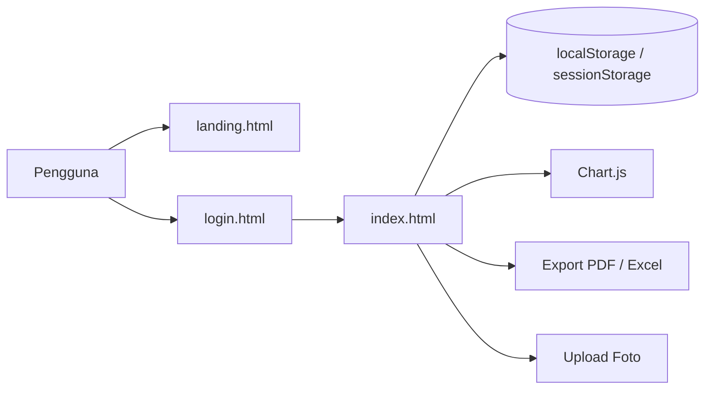
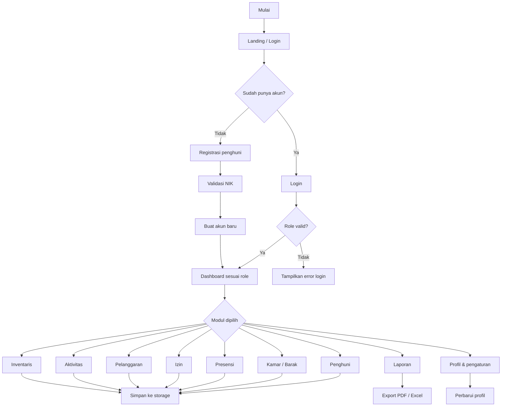

# SIMASRA — Sistem Informasi Monitoring dan Manajemen Asrama

> Dokumentasi ini disusun berdasarkan kondisi aktual proyek yang ada di workspace saat ini: halaman landing, halaman login, dashboard utama, dan logika aplikasi di `asset/js/script.js`.

## 1. Ringkasan Proyek

SIMASRA adalah aplikasi web berbasis browser untuk mengelola operasional asrama mahasiswa Kabupaten Deiyai di Kota Studi Jayapura. Aplikasi ini mencakup data penghuni, pengelolaan kamar dan barak, presensi, izin keluar masuk, pelanggaran, aktivitas asrama, inventaris, laporan, serta profil dan akses pengguna.

Sistem ini berjalan sepenuhnya di sisi klien menggunakan HTML, CSS, Alpine.js, Tailwind CSS, dan browser storage (`localStorage` dan `sessionStorage`). Proyek ini tidak memiliki backend atau database server, sehingga semua data utama diproses dan disimpan di browser pengguna.

### Diagram Arsitektur Sistem



### Diagram Alur Utama



## 2. Teknologi yang Digunakan

| Komponen       | Teknologi                         | Keterangan                                 |
| :------------- | :-------------------------------- | :----------------------------------------- |
| UI & state     | Alpine.js 3.x                     | Digunakan di landing, login, dan dashboard |
| Styling        | Tailwind CSS + CSS custom         | Dibangun secara lokal lewat `tailwindcss`  |
| Notifikasi     | SweetAlert2                       | Digunakan untuk dialog dan konfirmasi      |
| QR generator   | qrcodejs                          | Untuk kartu anggota penghuni               |
| QR scanner     | html5-qrcode                      | Untuk presensi QR                          |
| Chart          | Chart.js                          | Grafik dashboard dan laporan               |
| Export dokumen | jsPDF + AutoTable + SheetJS       | Export PDF dan Excel                       |
| Storage        | `localStorage` / `sessionStorage` | Menyimpan data utama dan sesi pengguna     |
| Sinkronisasi   | browser `storage` event           | Sinkronisasi antar tab                     |

## 3. Struktur File Proyek

```text
ASDEY-Monitoring/
├── index.html                  # Dashboard utama aplikasi
├── landing.html               # Landing page publik
├── login.html                 # Halaman login dan registrasi
├── README.md                  # Dokumentasi proyek
├── package.json               # Konfigurasi npm dan Tailwind
├── package-lock.json          # Lock file dependencies
├── tailwind.config.js         # Konfigurasi Tailwind
├── proposal_simasra.docx      # Proposal sistem
├── DFD-Level 1.jpg            # Diagram DFD
├── ERD.drawio.svg             # Diagram ERD vektor
├── ERD.jpg                   # Diagram ERD gambar
├── asset/
│   ├── css/
│   │   ├── landing.css        # Style landing page
│   │   ├── login.css          # Style login page
│   │   ├── style.css          # Style umum dashboard
│   │   ├── tailwind-source.css
│   │   └── tailwind-output.css
│   ├── img/
│   │   ├── logo-login.png
│   │   ├── logo-kabupaten.png
│   │   ├── android-chrome-192x192.png
│   │   ├── site.webmanifest
│   │   └── ...
│   ├── js/
│   │   └── script.js          # Logika inti aplikasi
│   └── xml/
│       └── ...                # File XML draw.io
├── node_modules/              # Dependency lokal
└── .git/                      # Metadata repositori
```

## 4. Fitur yang Tersedia

### 4.1 Landing Page

- Hero section dengan branding ASDEI
- Navigasi antar section utama
- Statistik penghuni, kamar, dan alumni dari data lokal
- CTA ke login dan pendaftaran penghuni

### 4.2 Login dan Registrasi

- Login menggunakan username dan password
- Registrasi akun baru untuk penghuni
- Validasi NIK dengan data penghuni yang sudah ada
- Reset password untuk akun penghuni
- Quick demo login untuk role admin, pembina, pimpinan, dan penghuni

### 4.3 Dashboard Utama

- Data penghuni: tambah, edit, hapus, status, dan foto
- Manajemen barak dan kamar
- Batas maksimal penghuni per kamar: 3 orang
- Presensi manual dan QR
- Izin keluar masuk
- Pelanggaran dan aktivitas asrama
- Inventaris per kamar/barak
- Laporan dengan grafik dan export PDF/Excel
- Profil pengguna dan pengaturan akun
- Manajemen pengguna untuk role admin

## 5. Role Access

Akses fitur diatur berdasarkan role aktif pada script aplikasi.

| Role       | Akses                                                                                             |
| :--------- | :------------------------------------------------------------------------------------------------ |
| `admin`    | dashboard, penghuni, kamar, presensi, izin, pelanggaran, aktivitas, inventaris, laporan, pengguna |
| `pembina`  | dashboard, penghuni, kamar, presensi, izin, pelanggaran, aktivitas, inventaris, laporan           |
| `pimpinan` | dashboard, penghuni, kamar, presensi, izin, pelanggaran, aktivitas, inventaris, laporan           |
| `penghuni` | dashboard, kartu, presensi, izin, pelanggaran, aktivitas                                          |

Catatan:

- Hanya `admin` yang dapat mengelola modul pengguna.
- `pembina` dan `pimpinan` bersifat monitoring/operasional.
- `penghuni` hanya dapat melihat data yang relevan dengan dirinya.

## 6. Data dan Storage

Proyek tidak menggunakan backend, jadi seluruh data utama disimpan di browser dengan kunci berikut:

- `simasra_penghuni`
- `simasra_barak`
- `simasra_inventaris`
- `simasra_presensi`
- `simasra_izin`
- `simasra_pelanggaran`
- `simasra_aktivitas`
- `simasra_users`
- `simasra_notifikasi`
- `simasra_user_profile::username`
- `simasra_user_settings::username`

Session login disimpan pada key seperti:

- `loggedInRole`
- `loggedInUsername`
- `loggedInUserId`
- `loggedInNik`
- `isLoggedIn`

## 7. Akun Demo Default

Akun default yang dipetakan di aplikasi adalah:

| Role       | Username   | Password      | Keterangan                                   |
| :--------- | :--------- | :------------ | :------------------------------------------- |
| `admin`    | `admin`    | `admin123`    | Full access                                  |
| `pembina`  | `pembina`  | `pembina123`  | Monitoring operasional                       |
| `pimpinan` | `pimpinan` | `pimpinan123` | Monitoring & laporan                         |
| `penghuni` | `penghuni` | `penghuni123` | Penghuni aktif dengan NIK `9102017501010001` |

## 8. Cara Menjalankan Proyek

### Persiapan awal

```bash
npm install
npm run build:css
```

### Jalankan lokal server

```bash
python -m http.server 8080
```

Lalu buka:

- `http://localhost:8080/landing.html`
- `http://localhost:8080/login.html`
- `http://localhost:8080/index.html`

## 9. Catatan Teknis

1. Proyek ini merupakan aplikasi prototype/browser-based, bukan sistem produksi dengan API backend.
2. Data disimpan di browser masing-masing pengguna dan tidak bersifat terpusat.
3. Login dan dashboard saling terhubung lewat `sessionStorage` dan `storage` event.
4. `asset/js/script.js` memuat data awal jika storage kosong, termasuk akun demo dan data awal asrama.
5. `MAX_PENGHUNI_PER_KAMAR` saat ini diatur ke `3`.
6. File `tailwind-output.css` dibuat melalui build lokal; update styling dapat dilakukan dengan perintah `npm run build:css`.

## 10. Audit Akhir

Berdasarkan audit terhadap file proyek saat ini:

- Struktur halaman utama sudah konsisten antara `landing.html`, `login.html`, dan `index.html`.
- Fitur utama yang ada sesuai dengan logika di `asset/js/script.js`.
- Role access dan akun demo sudah konsisten dengan file script.
- Validasi JavaScript pada `asset/js/script.js` telah berhasil dengan perintah `node --check asset/js/script.js` dan exit code `0`.

## 11. Keterbatasan Sistem

- Belum ada backend/API untuk autentikasi, data terpusat, dan keamanan tingkat produksi.
- Password tidak dienkripsi di sisi server karena aplikasi ini masih berbasis browser-only.
- Data bersifat lokal di mesin pengguna, sehingga tidak cocok untuk use case multi-user real-time skala besar.

## 12. Penutup

SIMASRA adalah prototype sistem informasi manajemen asrama yang berfungsi dengan baik untuk kebutuhan demonstrasi, pengujian fitur, dan dokumentasi akademik. Aplikasi ini sudah cukup layak untuk demo operasional dasar, namun untuk penggunaan nyata dan skala produksi, diperlukan pengembangan ke backend yang aman dan data yang terpusat.

_Hak Cipta © 2026 — Asrama Mahasiswa Kabupaten Deiyai, Kota Studi Jayapura._
