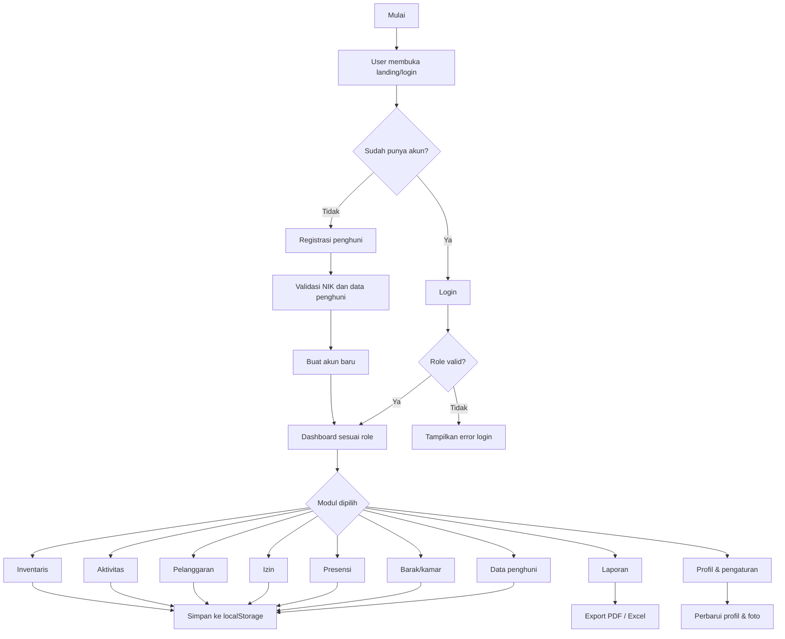
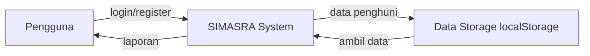
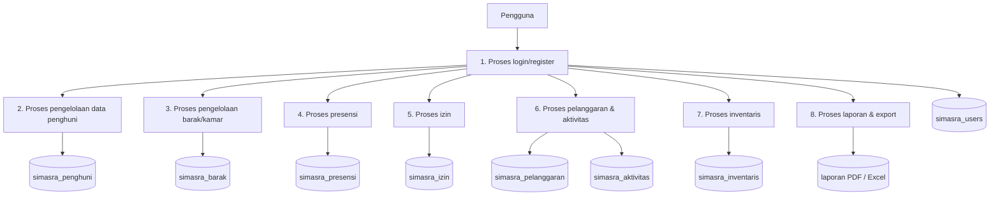
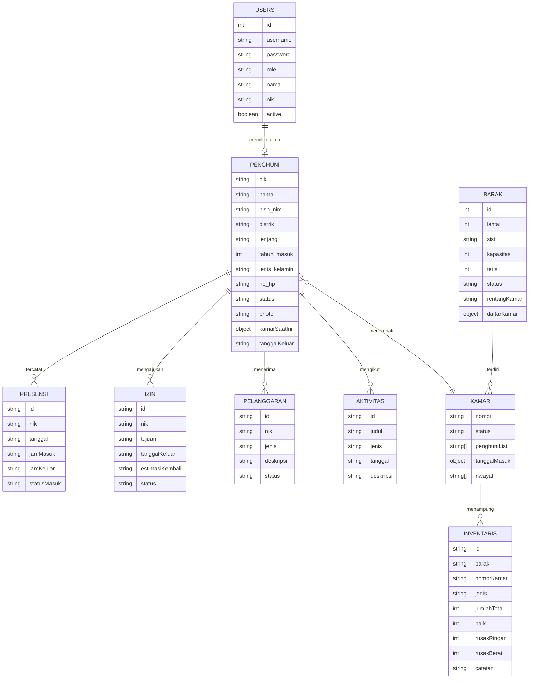

# ANALISIS PERANCANGAN SISTEM

## 1. Latar Belakang dan Cakupan Sistem

Sistem ini merupakan aplikasi web berbasis browser (client-side SPA) untuk mengelola operasional Asrama Mahasiswa Kabupaten Deiyai di Kota Studi Jayapura. Sistem berjalan melalui file HTML/JavaScript pada proyek ini, terutama:

- `landing.html` untuk halaman landing page
- `login.html` untuk login, register, dan lupa sandi
- `index.html` untuk dashboard utama
- `asset/js/script.js` untuk seluruh logika aplikasi

Karakteristik utama sistem saat ini:

- Tidak memiliki backend/server-side API
- Semua data utama disimpan di browser melalui `localStorage` dan `sessionStorage`
- Menggunakan Alpine.js sebagai state management UI
- Menggunakan Tailwind CSS build lokal (`asset/css/tailwind-output.css`)
- Mendukung role-based access control (RBAC) untuk `admin`, `pembina`, `pimpinan`, dan `penghuni`
- Mendukung upload foto penghuni/profil, presensi QR, laporan PDF/Excel, dan sinkronisasi data antar tab browser

---

## 2. Kebutuhan Sistem

### 2.1 Users Requirements (Kebutuhan Pengguna)

Berdasarkan implementasi saat ini, kebutuhan pengguna yang dipenuhi adalah:

1. Pengguna dapat masuk ke sistem melalui halaman login.
2. Pengguna dapat melakukan register akun penghuni baru.
3. Pengguna dapat melakukan reset password untuk akun penghuni.
4. Role `admin`, `pembina`, dan `pimpinan` dapat mengakses dashboard operasional.
5. Role `penghuni` dapat mengakses dashboard personal, kartu anggota, presensi, izin, pelanggaran, dan aktivitas.
6. Admin/pembina/pimpinan dapat mengelola data penghuni, barak/kamar, inventaris, laporan, dan pengguna.
7. Penghuni dapat mengajukan izin keluar masuk dan melihat riwayat aktivitasnya.
8. Sistem menyediakan cetak/unduh kartu anggota, laporan PDF, dan laporan Excel.
9. Sistem menyediakan fitur foto penghuni dan foto profil per akun.
10. Sistem menyediakan data real-time di browser melalui storage event dan sinkronisasi antar tab.

### 2.2 Analisis Pengguna Sistem

Pengguna sistem terbagi menjadi beberapa role utama:

| Role       | Deskripsi            | Hak Akses Utama                                                  |
| ---------- | -------------------- | ---------------------------------------------------------------- |
| `admin`    | Administrator sistem | Full access termasuk manajemen pengguna                          |
| `pembina`  | Pembina asrama       | Monitoring dan operasional, tetapi tidak bisa mengelola pengguna |
| `pimpinan` | Pimpinan/koordinator | Monitoring dan laporan                                           |
| `penghuni` | Penghuni asrama      | Data personal, presensi, izin, pelanggaran, aktivitas            |

Karakteristik pengguna:

- Memiliki kebutuhan operasional harian dan monitoring data asrama
- Menggunakan browser dan tidak memerlukan instalasi backend
- Mengharapkan pengalaman cepat, responsif, dan mudah digunakan

---

## 3. Analisis Sistem

### 3.1 Analisis Proses Bisnis

Proses bisnis utama yang dijalankan oleh sistem adalah:

1. Login dan autentikasi pengguna
2. Registrasi penghuni baru
3. Pengelolaan data penghuni
4. Pengelolaan barak dan kamar
5. Presensi masuk/keluar dan QR scanner
6. Pengajuan izin keluar masuk
7. Pencatatan pelanggaran dan aktivitas
8. Inventarisasi barang asrama
9. Laporan dan ekspor dokumen
10. Manajemen akun dan profil pengguna

### 3.2 Analisis Permasalahan

#### 3.2.1 Masalah yang terjadi

Berdasarkan hasil audit sistem saat ini, beberapa masalah dan inkonsistensi yang ditemukan adalah:

1. Penggunaan Tailwind CDN pada `index.html` menyebabkan warning pada lingkungan produksi.
2. Scheduler chart di `asset/js/script.js` menggunakan `requestAnimationFrame` yang memicu warning performa di browser.
3. Awalnya modal tambah/edit data penghuni tidak menyediakan field foto, sehingga foto penghuni tidak bisa diolah secara konsisten.
4. Foto profil pengguna dan foto penghuni belum sepenuhnya sinkron, sehingga ada kemungkinan data profil dan data master penghuni tidak konsisten.
5. Dokumentasi proyek (`README.md`) belum sepenuhnya mencerminkan struktur file aktual dan fitur terbaru.

#### 3.2.2 Penyebab masalah

1. Penggunaan CDN Tailwind pada halaman dashboard yang seharusnya dipakai dengan build lokal untuk kebutuhan produksi.
2. Implementasi scheduler chart terlalu agresif dalam membangkitkan render pada tiap perubahan data.
3. Belum ada field dan handler penyimpanan foto pada modal tambah/edit penghuni.
4. Belum ada sinkronisasi dua arah antara `userProfile` dan data master `penghuni` untuk foto dan nomor HP.
5. Dokumentasi belum diperbarui setelah penambahan file build Tailwind dan fitur foto.

---

## 4. Flow Chart

### 4.1 Flow Chart Sistem Utama



---

## 5. Data Flow Diagram (DFD)

### 5.1 DFD Level 0



### 5.2 DFD Level 1



---

## 6. Desain Data

### 6.1 Entity Relationship Diagram (ERD / Conceptual Data Model)

Karena sistem tidak menggunakan database relasional, ERD ini disajikan dalam bentuk conceptual data model yang merepresentasikan hubungan logis antar entitas utama.



### 6.2 Mapping Tabel / Physical Data Model (PDM)

Karena sistem ini tidak menggunakan SQL Server/MySQL/PostgreSQL, PDM-nya dipetakan ke struktur penyimpanan browser berdasarkan `localStorage` keys dan struktur array/object di `asset/js/script.js`.

| Entitas Logis  | Storage Key / Struktur            | Keterangan                  |
| -------------- | --------------------------------- | --------------------------- |
| `penghuni`     | `simasra_penghuni`                | Array obyek data penghuni   |
| `barak`        | `simasra_barak`                   | Array obyek barak dan kamar |
| `inventaris`   | `simasra_inventaris`              | Array obyek inventaris      |
| `presensi`     | `simasra_presensi`                | Array data presensi         |
| `izin`         | `simasra_izin`                    | Array data izin             |
| `pelanggaran`  | `simasra_pelanggaran`             | Array data pelanggaran      |
| `aktivitas`    | `simasra_aktivitas`               | Array data aktivitas        |
| `users`        | `simasra_users`                   | Array data akun pengguna    |
| `notifikasi`   | `simasra_notifikasi`              | Array notifikasi            |
| `userProfile`  | `simasra_user_profile::username`  | Profil per akun             |
| `userSettings` | `simasra_user_settings::username` | Pengaturan per akun         |

### 6.3 Kodefikasi

Dalam sistem ini, kodefikasi tidak menggunakan nomer unik relasional seperti `PK001`, namun tetap ada pola identifikasi utama:

- `nik` digunakan sebagai identifier unik penghuni
- `id` digunakan untuk objek `users`, `barak`, `izin`, `pelanggaran`, `aktivitas`, dan `inventaris`
- `username` digunakan sebagai identifier akun pengguna
- `currentUserId` dan `currentNik` dipakai pada session storage untuk identifikasi login aktif

Contoh pola penamaan:

- `users.id` → angka unik (`Date.now()` atau hasil dari form)
- `barak.id` → angka unik
- `izin.id` → angka unik
- `pelanggaran.id` → angka unik
- `aktivitas.id` → angka unik
- `inventaris.id` → angka unik

### 6.4 Struktur Tabel / Objek

#### a. Data Penghuni (`simasra_penghuni`)

```json
{
  "nik": "9102017501010001",
  "nama": "Yohanis Duwiri",
  "nisn_nim": "123456789012",
  "distrik": "Tigi",
  "jenjang": "SMA",
  "tahun_masuk": 2023,
  "jenis_kelamin": "Laki-laki",
  "no_hp": "0812xxxxxxx",
  "status": "aktif",
  "photo": "data:image/png;base64,...",
  "kamarSaatIni": { "barakId": 1, "nomorKamar": "101" },
  "tanggalKeluar": null
}
```

#### b. Data Barak dan Kamar (`simasra_barak`)

```json
{
  "id": 1,
  "lantai": 1,
  "sisi": "Barak Kiri",
  "kapasitas": 7,
  "terisi": 0,
  "status": "kosong",
  "rentangKamar": "101-107",
  "daftarKamar": [
    {
      "nomor": "101",
      "status": "kosong",
      "penghuniList": [],
      "riwayat": []
    }
  ]
}
```

#### c. Data Akun Pengguna (`simasra_users`)

```json
{
  "id": 4,
  "username": "penghuni",
  "password": "penghuni123",
  "role": "penghuni",
  "nama": "Yohanis Duwiri",
  "nik": "9102017501010001",
  "active": true
}
```

#### d. Data Presensi (`simasra_presensi`)

```json
{
  "id": 1720000000000,
  "nik": "9102017501010001",
  "tanggal": "2026-09-13",
  "jamMasuk": "07:00",
  "jamKeluar": "17:00",
  "statusMasuk": "tepat_waktu"
}
```

#### e. Data Izin (`simasra_izin`)

```json
{
  "id": 1720000000001,
  "nik": "9102017501010001",
  "tujuan": "Kota Jayapura",
  "tanggalKeluar": "2026-09-13",
  "estimasiKembali": "2026-09-14",
  "status": "menunggu"
}
```

#### f. Data Pelanggaran (`simasra_pelanggaran`)

```json
{
  "id": 1720000000002,
  "nik": "9102017501010001",
  "jenis": "kurang_disiplin",
  "deskripsi": "Terlambat hadir",
  "status": "proses"
}
```

#### g. Data Aktivitas (`simasra_aktivitas`)

```json
{
  "id": 1720000000003,
  "judul": "Kerja Bakti",
  "jenis": "kebersihan",
  "tanggal": "2026-09-12",
  "deskripsi": "Membersihkan area barak"
}
```

#### h. Data Inventaris (`simasra_inventaris`)

```json
{
  "id": 1720000000004,
  "barak": "Barak Kiri",
  "nomorKamar": "101",
  "jenis": "meja",
  "jumlahTotal": 2,
  "baik": 2,
  "rusakRingan": 0,
  "rusakBerat": 0,
  "catatan": "Sudah layak pakai"
}
```

### 6.5 Pengaturan Hak Akses Tabel

Karena sistem ini berbasis browser dan localStorage, pengaturan hak akses ditangani melalui `currentRole` dan `ROLE_ACCESS` di `asset/js/script.js`.

| Key / Struktur                    | Role yang bisa akses                                                                | Keterangan                          |
| --------------------------------- | ----------------------------------------------------------------------------------- | ----------------------------------- |
| `simasra_penghuni`                | `admin`, `pembina`, `pimpinan`, `penghuni` (read), `admin/pembina/pimpinan` (write) | Data master penghuni                |
| `simasra_barak`                   | `admin`, `pembina`, `pimpinan`, `penghuni` (read)                                   | Data struktur barak/kamar           |
| `simasra_presensi`                | `admin`, `pembina`, `pimpinan`, `penghuni` (read own data)                          | Presensi harian                     |
| `simasra_izin`                    | semua role, dengan pembatasan data berdasarkan `currentNik`                         | Penghuni hanya melihat data sendiri |
| `simasra_pelanggaran`             | semua role, dengan pembatasan data berdasarkan `currentNik`                         | Penghuni hanya melihat data sendiri |
| `simasra_aktivitas`               | semua role                                                                          | Data aktivitas asrama               |
| `simasra_inventaris`              | `admin`, `pembina`, `pimpinan`                                                      | Inventaris operasional              |
| `simasra_users`                   | `admin`                                                                             | Manajemen akun pengguna             |
| `simasra_notifikasi`              | semua role                                                                          | Notifikasi sesuai role/nik          |
| `simasra_user_profile::username`  | per akun aktif                                                                      | Profil dan foto per akun            |
| `simasra_user_settings::username` | per akun aktif                                                                      | Pengaturan profil per akun          |

---

## 7. Desain Input (Formulir)

Formulir yang tersedia berdasarkan implementasi saat ini adalah:

1. Form Login
   - username
   - password
   - remember me

2. Form Register Penghuni
   - nama lengkap
   - NIK
   - username
   - password
   - konfirmasi password

3. Form Tambah/Edit Penghuni
   - NIK
   - Nama lengkap
   - NISN/NIM
   - Distrik
   - Jenjang
   - Tahun masuk
   - Jenis kelamin
   - No HP/WA
   - Status (`aktif`, `keluar`, `alumni`)
   - Tanggal keluar (jika status tidak aktif)
   - Foto penghuni (unggah gambar)

4. Form Tambah/Edit Barak
   - lantai
   - sisi barak
   - kapasitas

5. Form Assign Kamar
   - pilih barak
   - pilih kamar
   - pilih penghuni

6. Form Presensi
   - NIK penghuni
   - presensi manual atau QR scanner

7. Form Izin
   - NIK
   - tujuan
   - tanggal keluar
   - estimasi kembali

8. Form Pelanggaran
   - NIK
   - jenis pelanggaran
   - deskripsi
   - status

9. Form Aktivitas
   - judul
   - jenis aktivitas
   - tanggal
   - deskripsi

10. Form Profil & Pengaturan

- nama lengkap
- email
- nomor HP
- foto profil
- pengaturan password

---

## 8. Desain Antar Muka (User Interface)

### 8.1 Halaman Landing

- Hero section
- Navigasi antar section (`Tentang`, `Fitur`, `Untuk Siapa`, `Kontak`)
- Statistik asrama
- CTA ke login dan register
- Dark mode toggle
- FAB (floating action button)

### 8.2 Halaman Login

- Form login
- Tab register
- Tab lupa sandi
- Demo login cepat untuk role `admin`, `pembina`, `pimpinan`, dan `penghuni`
- Dark mode support

### 8.3 Halaman Dashboard

Dashboard utama terdiri dari beberapa modul utama:

- Stat card ringkasan
- Grafik status penghuni
- Grafik hunian barak
- Grafik kehadiran mingguan
- Tabel data penghuni
- Tabel barak/kamar
- Tabel inventaris
- Modal profil, kartu anggota, scanner QR, laporan, dan pengaturan

UI yang digunakan saat ini berbasis:

- `index.html` dengan layout utama dashboard
- `asset/css/style.css` untuk styling umum
- `asset/css/landing.css` dan `asset/css/login.css` untuk halaman tertentu

---

## 9. Desain Output (Bentuk-bentuk Laporan)

Output yang disediakan oleh sistem adalah:

1. Laporan Ringkasan Dashboard
   - penghuni aktif
   - tingkat hunian
   - alumni tahun ini
   - slot tersedia
   - total inventaris

2. Laporan Per Distrik
   - jumlah penghuni aktif per distrik

3. Laporan Per Jenjang
   - jumlah penghuni aktif per jenjang pendidikan

4. Laporan Inventaris
   - total barang
   - jumlah baik / rusak ringan / rusak berat

5. Export PDF
   - laporan ringkasan dengan format PDF

6. Export Excel
   - laporan data terstruktur dalam file `.xlsx`

7. Backup Data JSON
   - file backup keseluruhan data utama sistem

8. Kartu Anggota / KTA
   - kartu anggota berisi data penghuni dan QR code

---

## 10. Kesimpulan

Sistem SIMASRA yang saat ini ada merupakan aplikasi browser-side yang cukup lengkap untuk kebutuhan monitoring dan pengelolaan asrama mahasiswa. Dari sisi analisis dan perancangan, sistem sudah mencakup komponen inti seperti user requirements, data model, RBAC, alur utama, form input, UI, serta output laporan.

Perbaikan yang sudah dilakukan sebelumnya, seperti penggantian Tailwind CDN ke build lokal, penambahan foto penghuni, dan sinkronisasi foto profil dengan data penghuni, membuat dokumentasi ini lebih konsisten dengan kondisi proyek aktual.

---

## 11. Catatan Akhir

Dokumen ini dibuat berdasarkan implementasi yang saat ini terdapat di:

- `index.html`
- `landing.html`
- `login.html`
- `asset/js/script.js`
- `README.md`

Dengan demikian, isi dokumen ini merupakan versi final yang konsisten dan akurat terhadap sistem yang benar-benar tersedia di workspace saat ini.
