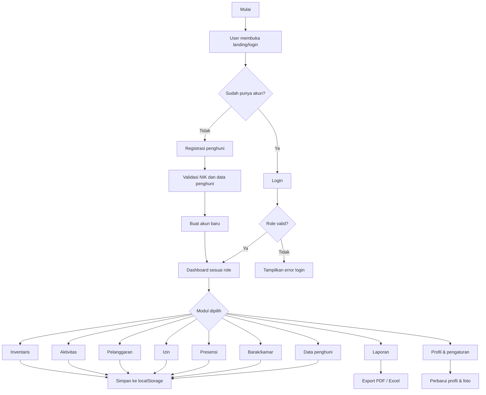
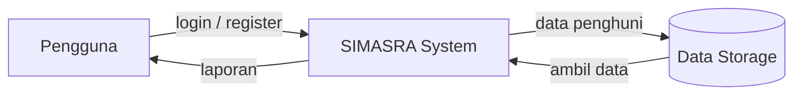
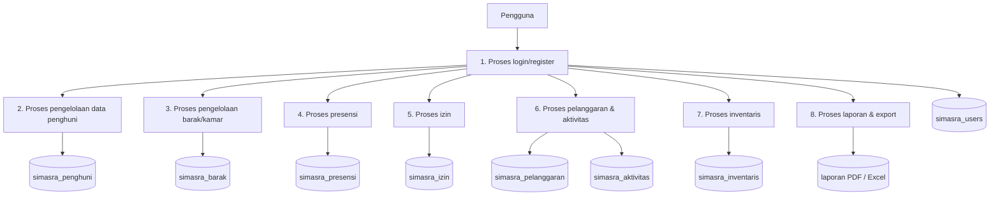
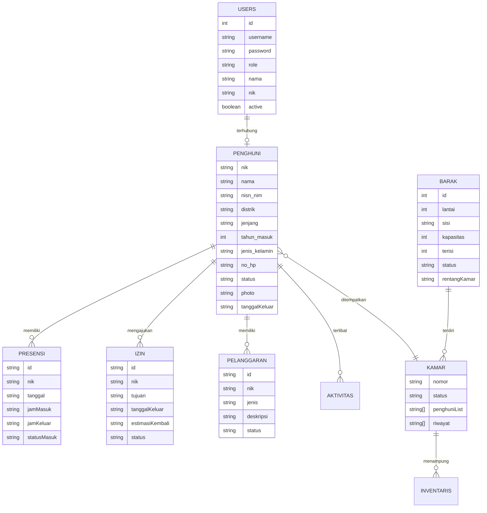

# Laporan Formal Analisis dan Perancangan Sistem SIMASRA

## 1. Pendahuluan

Sistem Informasi Monitoring dan Manajemen Asrama Mahasiswa Kabupaten Deiyai (SIMASRA) merupakan aplikasi berbasis web yang dirancang untuk membantu pengelolaan operasional asrama secara terstruktur, efektif, dan efisien. Sistem ini dikembangkan dalam bentuk aplikasi client-side yang dijalankan melalui browser dan memanfaatkan teknologi HTML, JavaScript, Alpine.js, Tailwind CSS, dan penyimpanan lokal berbasis browser.

Pengembangan sistem ini bertujuan untuk memfasilitasi proses administrasi asrama, termasuk pengelolaan data penghuni, penempatan kamar, presensi, izin keluar-masuk, pelanggaran, aktivitas, inventaris, serta pelaporan. Dengan sistem ini, pengelola asrama dapat memantau data secara real-time melalui dashboard yang terintegrasi dan dapat diakses sesuai dengan hak akses masing-masing pengguna.

## 2. Rumusan Masalah

Berdasarkan kebutuhan operasional asrama, permasalahan yang umum dihadapi meliputi:

1. Proses pencatatan data penghuni masih belum terintegrasi secara rapi.
2. Pengelolaan presensi dan izin masih bersifat manual dan rentan terhadap kesalahan.
3. Pengelola membutuhkan informasi cepat mengenai kondisi kamar, penghuni, dan inventaris.
4. Sistem perlu mendukung pembagian akses berbasis peran pengguna agar data dapat diatur sesuai kebutuhan.
5. Diperlukan mekanisme pelaporan yang sederhana namun akurat untuk mendukung pengambilan keputusan.

## 3. Tujuan Pengembangan Sistem

Tujuan utama dari pengembangan SIMASRA adalah:

- memudahkan pengelolaan data penghuni dan pengguna sistem;
- menyediakan mekanisme presensi dan izin yang lebih terstruktur;
- memfasilitasi monitoring aktivitas dan pelanggaran penghuni;
- menampilkan informasi operasional asrama melalui dashboard dan laporan;
- menjaga keamanan informasi melalui pembagian hak akses berdasarkan peran pengguna.

## 4. Ruang Lingkup Sistem

Sistem ini mencakup beberapa modul utama, yaitu:

- manajemen data penghuni;
- pengelolaan barak dan kamar;
- presensi harian;
- pengajuan dan pemantauan izin;
- pencatatan pelanggaran;
- pengelolaan aktivitas asrama;
- inventaris barang;
- laporan dan ekspor data;
- manajemen profil dan pengaturan pengguna.

## 5. Kebutuhan Pengguna

### 5.1 Kebutuhan Fungsional

Kebutuhan fungsional sistem meliputi:

- pengguna dapat masuk ke aplikasi melalui proses login;
- pengguna baru dapat melakukan registrasi sebagai penghuni;
- admin dapat mengelola akun pengguna dan data master;
- pembina, pimpinan, dan admin dapat melihat data operasional asrama;
- penghuni dapat melihat data dirinya sendiri dan mengajukan izin;
- sistem mampu menyimpan data dalam localStorage dan sessionStorage;
- sistem dapat menampilkan laporan dalam bentuk tabel, chart, PDF, dan Excel.

### 5.2 Kebutuhan Non-Fungsional

Kebutuhan non-fungsional meliputi:

- antarmuka pengguna yang sederhana dan mudah dipahami;
- akses berbasis role untuk menjaga keamanan data;
- performa yang cepat dalam penggunaan browser lokal;
- kompatibilitas lintas browser yang umum digunakan;
- data tetap terdokumentasi dengan baik dalam penyimpanan browser.

## 6. Analisis Pengguna Sistem

Sistem ini memiliki beberapa peran pengguna yang berbeda, yaitu:

| Peran    | Deskripsi                    | Hak Akses Utama                                       |
| -------- | ---------------------------- | ----------------------------------------------------- |
| Admin    | Pengelola utama sistem       | Mengakses seluruh modul dan manajemen pengguna        |
| Pembina  | Pengelola operasional asrama | Mengakses monitoring dan pengelolaan data operasional |
| Pimpinan | Pengambil keputusan          | Mengakses laporan dan monitoring utama                |
| Penghuni | Pengguna aktif asrama        | Mengakses data sendiri, presensi, izin, dan aktivitas |

Pembagian peran ini diperlukan agar fungsi sistem dapat disesuaikan dengan kewenangan masing-masing pengguna serta menjaga integritas data.

## 7. Analisis Proses Bisnis

Proses bisnis dalam sistem ini dimulai dari masuknya pengguna ke halaman landing dan login. Pengguna kemudian dapat melakukan login atau registrasi. Setelah berhasil masuk, sistem akan menilai role pengguna dan menampilkan dashboard sesuai dengan hak aksesnya. Selanjutnya pengguna dapat memilih modul yang dibutuhkan, seperti data penghuni, barak, presensi, izin, pelanggaran, aktivitas, inventaris, maupun laporan.

Setiap modul akan melakukan validasi input dan menyimpan data ke penyimpanan lokal. Pada proses laporan, aplikasi dapat mengekspor data ke format PDF atau Excel sesuai kebutuhan pengelola.

## 8. Diagram Alir Sistem

### 8.1 Flowchart Utama

## 9. Data Flow Diagram

### 9.1 DFD Level 0

### 9.2 DFD Level 1

## 10. Desain Data

### 10.1 Entity Relationship Diagram

### 10.2 Struktur Data Utama

Sistem ini menggunakan struktur data berbasis objek yang disimpan pada browser melalui penyimpanan lokal. Struktur utama meliputi:

- `simasra_users`
- `simasra_penghuni`
- `simasra_barak`
- `simasra_presensi`
- `simasra_izin`
- `simasra_pelanggaran`
- `simasra_aktivitas`
- `simasra_inventaris`
- `simasra_notifikasi`
- `simasra_user_profile::username`
- `simasra_user_settings::username`

## 11. Kodefikasi dan Hak Akses

Penggunaan kodefikasi didasarkan pada identifier unik, seperti `NIK` untuk penghuni, serta `id` untuk data operasional. Sementara itu, hak akses diatur melalui `currentRole` dan `ROLE_ACCESS` pada aplikasi. Aturan akses utama adalah sebagai berikut:

- Admin memiliki akses penuh terhadap seluruh modul.
- Pembina dan pimpinan memiliki akses operasional dan laporan.
- Penghuni hanya dapat mengakses data diri, presensi, izin, pelanggaran, dan aktivitas.
- Data akun dan pengaturan pengguna hanya dapat dikelola oleh admin.

## 12. Desain Input dan Antarmuka

### 12.1 Desain Input

Formulir yang tersedia pada sistem mencakup:

- login;
- registrasi penghuni;
- tambah dan edit data penghuni;
- data barak dan kamar;
- presensi manual dan QR;
- izin keluar-masuk;
- pelanggaran;
- aktivitas;
- profil dan pengaturan pengguna.

### 12.2 Desain Antarmuka

Antarmuka sistem terdiri dari:

- halaman landing;
- halaman login;
- dashboard utama;
- sidebar navigasi berbasis peran;
- panel statistik dan grafik;
- tabel data master;
- modal interaktif untuk proses tambah, edit, kartu anggota, QR, dan laporan.

## 13. Desain Output

Output yang dihasilkan sistem meliputi:

- laporan ringkasan asrama;
- laporan per distrik;
- laporan per jenjang pendidikan;
- laporan inventaris;
- export PDF;
- export Excel;
- backup data JSON;
- kartu anggota / KTA dengan QR code.

## 14. Kesimpulan

Sistem SIMASRA merupakan solusi yang relevan untuk mendukung pengelolaan asrama secara terstruktur dan efisien. Dengan pendekatan berbasis browser, aplikasi ini mampu memberikan layanan operasional yang cepat dan mudah diakses tanpa memerlukan infrastruktur backend yang kompleks. Keunggulan utama sistem ini terletak pada integrasi data, pembagian hak akses, visualisasi informasi, dan kemudahan dalam pengelolaan data asrama.

Melalui pendekatan analisis dan perancangan yang telah dilakukan, sistem ini mampu menjawab kebutuhan operasional asrama dalam konteks monitoring, administrasi, dan pelaporan secara menyeluruh. Dengan demikian, SIMASRA dapat dijadikan sebagai prototipe sistem yang relevan untuk pengembangan lebih lanjut menuju implementasi berbasis server di masa depan.
