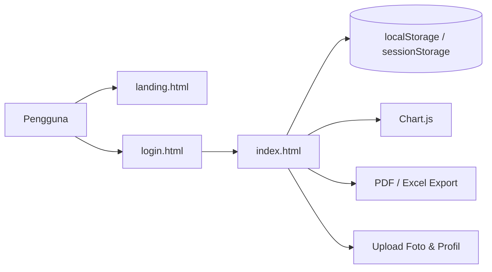
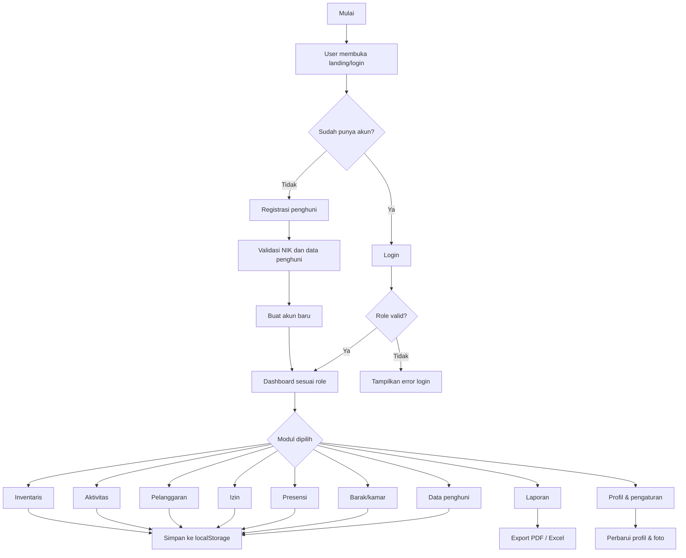
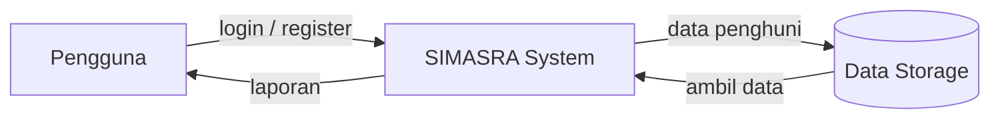
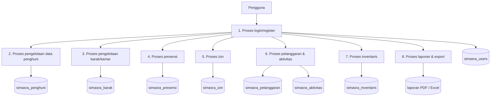
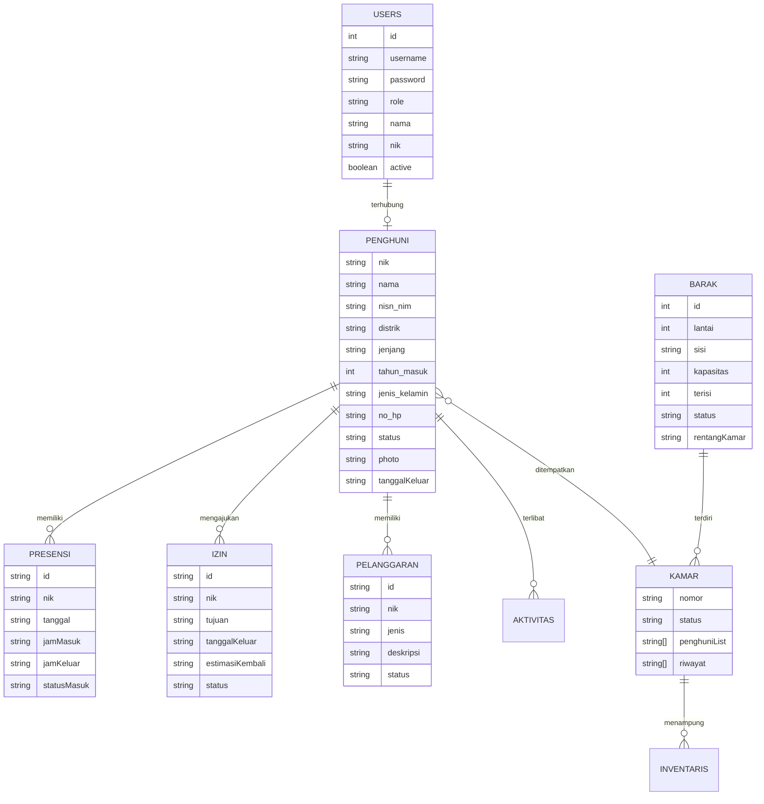

# BAB I

# PENDAHULUAN

## 1.1 Latar Belakang

Asrama mahasiswa merupakan salah satu fasilitas penting yang berperan dalam mendukung kegiatan akademik, pengembangan karakter, serta kesejahteraan mahasiswa. Di lingkungan asrama, pengelolaan data penghuni, pengaturan kamar, monitoring presensi, serta pencatatan aktivitas dan pelanggaran memerlukan sistem yang dapat dikelola secara terorganisir. Dalam praktiknya, banyak pengelolaan administrasi asrama masih dilakukan secara manual, sehingga rentan terhadap kesalahan pencatatan, keterlambatan pengolahan data, serta kesulitan dalam memperoleh informasi yang dibutuhkan secara cepat dan akurat.

Perkembangan teknologi informasi membuka peluang untuk membangun sistem berbasis web yang dapat memudahkan pengelola dalam mengelola seluruh aspek operasional asrama. Sistem Informasi Monitoring dan Manajemen Asrama Mahasiswa Kabupaten Deiyai (SIMASRA) dikembangkan sebagai solusi untuk mengatasi permasalahan tersebut. Sistem ini dirancang berbasis browser dan memanfaatkan teknologi client-side agar dapat dijalankan dengan mudah tanpa kebutuhan infrastruktur server yang kompleks. Melalui sistem ini, data penghuni, barak, kamar, presensi, izin, pelanggaran, inventaris, dan laporan dapat dikelola dalam satu platform yang terintegrasi.

Dalam pengembangannya, aplikasi ini bukan hanya berfungsi sebagai alat administrasi, tetapi juga sebagai sarana monitoring yang dapat membantu pihak asrama dalam mengambil keputusan secara cepat. Fitur seperti dashboard, chart, export laporan PDF/Excel, serta role-based access memungkinkan data tampil secara terstruktur dan sesuai dengan kebutuhan masing-masing pengguna. Dengan demikian, SIMASRA diharapkan menjadi solusi yang relevan dalam mendukung operasional asrama yang lebih efektif dan efisien.

## 1.2 Identifikasi Masalah

Berdasarkan observasi terhadap kebutuhan pengelolaan asrama, beberapa permasalahan yang muncul antara lain:

1. Proses pencatatan data penghuni masih belum tertata dengan baik dan cenderung bersifat tersebar.
2. Pengelolaan presensi dan izin belum terintegrasi dalam satu sistem yang mudah dipantau.
3. Data inventaris, pelanggaran, dan aktivitas asrama belum tercatat secara konsisten.
4. Pihak asrama sulit memperoleh informasi yang cepat dan akurat mengenai kondisi penghuni, kamar, dan tingkat hunian.
5. Pengelolaan data perlu dibatasi sesuai peran pengguna agar informasi tetap aman dan sesuai kewenangan.
6. Laporan masih sering dilakukan secara manual, sehingga membutuhkan waktu dan tenaga yang lebih besar.

## 1.3 Batasan Masalah

Penelitian dan pengembangan sistem ini dibatasi pada beberapa aspek berikut:

- Sistem dikembangkan berbasis web dan dijalankan di sisi klien dengan browser.
- Data utama disimpan menggunakan `localStorage` dan `sessionStorage`.
- Sistem hanya mencakup kebutuhan operasional internal asrama mahasiswa.
- Tidak dikembangkan backend database server secara penuh pada tahap ini.
- Role pengguna dibatasi pada empat kategori, yaitu admin, pembina, pimpinan, dan penghuni.
- Fitur utama yang dibahas meliputi data penghuni, barak/kamar, presensi, izin, pelanggaran, aktivitas, inventaris, dan laporan.

## 1.4 Tujuan Penelitian

Tujuan umum dari penelitian ini adalah untuk merancang dan membangun sistem informasi monitoring dan manajemen asrama berbasis web yang dapat mendukung kegiatan administrasi dan pengelolaan operasional asrama.

Tujuan khusus penelitian ini adalah:

1. membangun sistem yang dapat mengelola data penghuni secara terstruktur;
2. menyediakan modul barak dan kamar untuk mempermudah penempatan penghuni;
3. memfasilitasi presensi dan pengajuan izin secara terintegrasi;
4. membantu pengelola dalam memantau pelanggaran, aktivitas, dan inventaris asrama;
5. menghasilkan laporan yang dapat diekspor ke format PDF dan Excel;
6. membagi hak akses sesuai peran pengguna agar keamanan data lebih terjamin.

## 1.5 Manfaat Penelitian

### 1.5.1 Manfaat Teoritis

Penelitian ini memberikan kontribusi dalam bidang pengembangan sistem informasi berbasis web, khususnya pada penerapan konsep data management, role-based access control, dan desain antarmuka aplikasi untuk kebutuhan organisasi asrama.

### 1.5.2 Manfaat Praktis

Bagi pihak asrama, sistem ini memberikan manfaat dalam hal:

- mempermudah pengelolaan data penghuni;
- mempercepat proses presensi dan pelaporan;
- meningkatkan akurasi data operasional;
- memudahkan monitoring penghuni dan ketersediaan kamar;
- menjaga keamanan dan keteraturan akses data berdasarkan peran pengguna.

## 1.6 Sistematika Penulisan

Penulisan laporan ini disusun dengan urutan sebagai berikut:

1. Bab I: Pendahuluan, yang berisi latar belakang, identifikasi masalah, batasan masalah, tujuan, manfaat, dan sistematika penulisan.
2. Bab II: Landasan Teori, yang membahas konsep sistem informasi, pengelolaan data, role-based access, serta framework dan teknologi yang digunakan.
3. Bab III: Metode Penelitian, yang menjelaskan pendekatan, kebutuhan sistem, analisis pengguna, serta metode pengujian.
4. Bab IV: Hasil dan Pembahasan, yang memaparkan rancangan sistem, implementasi, serta hasil pengujian dan evaluasi.
5. Bab V: Penutup, yang berisi simpulan dan saran untuk pengembangan lebih lanjut.

---

# BAB II

# LANDASAN TEORI

## 2.1 Konsep Sistem Informasi

Sistem informasi adalah kombinasi dari komponen manusia, teknologi, proses, dan data yang bekerja bersama untuk mengumpulkan, memproses, menyimpan, dan mendistribusikan informasi dalam mendukung pengambilan keputusan. Sistem informasi berfungsi sebagai penghubung antara organisasi dengan kebutuhan pengolahan data secara sistematis.

Dalam konteks asrama, sistem informasi membantu pengelola dalam mengelola data penghuni dan operasional harian secara cepat, konsisten, dan terstruktur. Penggunaan sistem informasi mampu menurunkan tingkat kesalahan manual serta memperluas kemampuan monitoring dari sisi kinerja operasional.

## 2.2 Sistem Informasi Manajemen

Sistem informasi manajemen merupakan bentuk penerapan sistem informasi yang fokus pada kebutuhan organisasi dalam melakukan perencanaan, pengendalian, dan pengambilan keputusan. Pada asrama, sistem informasi manajemen dapat digunakan untuk mencatat data penghuni, jumlah kamar, presensi, izin, pelanggaran, perkembangan aktivitas, serta laporan berkala.

Aplikasi SIMASRA dikembangkan sesuai dengan kebutuhan sistem informasi manajemen asrama, dengan pendekatan berbasis web yang dirancang untuk mempermudah penggunaan dan pengelolaan data internal.

## 2.3 Role-Based Access Control

Role-Based Access Control (RBAC) adalah mekanisme pengaturan akses yang didasarkan pada peran pengguna di dalam sistem. Konsep ini berguna untuk memastikan bahwa setiap pengguna hanya dapat mengakses data dan fitur yang relevan dengan tugas dan kewenangannya.

Pada aplikasi SIMASRA, hak akses diatur berdasarkan peran utama, yaitu:

- admin;
- pembina;
- pimpinan;
- penghuni.

Setiap peran memiliki batasan akses yang berbeda. Misalnya, admin dapat mengelola akun pengguna dan seluruh modul, sedangkan penghuni hanya dapat melihat data yang berkaitan dengan dirinya sendiri serta aktivitas yang relevan.

## 2.4 Basis Data dan Penyimpanan Lokal

Dalam pengembangan aplikasi berbasis browser, penggunaan penyimpanan lokal menjadi solusi yang efektif untuk menyimpan data tanpa membangun server backend. Pada SIMASRA, data utama disimpan menggunakan `localStorage` dan `sessionStorage`.

`localStorage` digunakan untuk menyimpan data jangka panjang seperti data penghuni, data kamar, inventaris, kegiatan, dan pengguna. Sementara itu, `sessionStorage` digunakan untuk menyimpan kondisi sesi login pengguna seperti username, role, dan status login aktif. Pendekatan ini memudahkan aplikasi beroperasi secara mandiri tanpa kebutuhan database server pada tahap awal pengembangan.

## 2.5 Pengembangan Aplikasi Web Client-Side

Aplikasi web client-side adalah aplikasi yang sebagian besar logika dan antarmuka dijalankan di sisi browser pengguna. Dalam pengembangan ini, teknologi yang dipakai adalah:

- HTML untuk struktur halaman;
- CSS untuk desain antarmuka;
- JavaScript untuk logika aplikasi;
- Alpine.js untuk state management UI;
- Tailwind CSS untuk styling yang cepat dan konsisten;
- Chart.js untuk visualisasi data;
- SweetAlert2 untuk notifikasi dialog;
- jsPDF, AutoTable, dan SheetJS untuk export laporan;
- qrcodejs dan html5-qrcode untuk QR code dan presensi.

Penerapan teknologi ini memungkinkan sistem bekerja dengan cara yang ringan, cepat, dan mudah diimplementasikan pada lingkungan browser.

## 2.6 Laporan dan Visualisasi Data

Visualisasi data sangat penting dalam sistem informasi karena membantu pengguna memahami kondisi operasional dengan cepat. Dalam aplikasi SIMASRA, data ditampilkan dalam bentuk:

- statistik dashboard;
- chart status penghuni;
- chart tingkat hunian asrama;
- grafik kehadiran;
- laporan per distrik dan jenjang;
- tabel data operasional;
- format PDF dan Excel untuk ekspor data.

Dengan demikian, pengelola memperoleh informasi yang lebih jelas untuk pengambilan keputusan.

## 2.7 Penelitian Terkait

Beberapa penelitian dan sistem serupa pada umumnya berfokus pada penggunaan digitalisasi administrasi asrama, seperti pengelolaan data penghuni, monitoring presensi, dan laporan operasional. Namun, kebanyakan sistem tersebut masih membutuhkan infrastruktur backend yang lebih kompleks. SIMASRA dikembangkan dengan pendekatan yang lebih ringan dan praktis, sehingga cocok untuk kebutuhan asrama yang bersifat operasional dan berbasis browser.

---

# BAB III

# METODE PENELITIAN

## 3.1 Jenis Penelitian

Penelitian ini termasuk dalam jenis penelitian pengembangan (research and development) dengan pendekatan sistem informasi berbasis web. Metode ini dipilih karena tujuan utama penelitian adalah menghasilkan sistem yang dapat digunakan secara langsung untuk kebutuhan operasional asrama mahasiswa.

## 3.2 Metode Pengumpulan Data

Pengumpulan data dilakukan melalui beberapa teknik, yaitu:

1. observasi terhadap kebutuhan administrasi asrama;
2. studi dokumentasi terkait struktur data dan kebutuhan operasional;
3. analisis kebutuhan pengguna berdasarkan peran admin, pembina, pimpinan, dan penghuni;
4. evaluasi terhadap fitur yang tersedia pada aplikasi yang dikembangkan.

## 3.3 Analisis Kebutuhan Sistem

Analisis kebutuhan dilakukan untuk mengidentifikasi kebutuhan fungsional dan non-fungsional sistem. Kebutuhan fungsional utama meliputi pengelolaan data penghuni, pengelolaan kamar dan barak, presensi, izin, pelanggaran, aktivitas, inventaris, laporan, serta profil pengguna. Sedangkan kebutuhan non-fungsional mencakup antarmuka yang ramah pengguna, keamanan data berbasis role, serta performa aplikasi yang optimal.

## 3.4 Desain Sistem

Desain sistem dibagi menjadi beberapa bagian utama, yaitu:

- desain proses bisnis;
- desain data;
- desain input;
- desain antarmuka;
- desain output;
- desain keamanan berbasis peran.

Pada tahap ini, setiap kebutuhan ditransformasikan ke dalam struktur aplikasi agar sistem dapat dibangun dengan satu arsitektur yang konsisten.

## 3.5 Metode Pengembangan Sistem

Metode pengembangan yang digunakan adalah pendekatan perancangan berbasis kebutuhan pengguna serta implementasi prototipe. Prototipe awal dibuat berdasarkan kebutuhan fungsional utama, kemudian dilakukan evaluasi serta penyesuaian agar sesuai dengan kebutuhan sebenarnya. Tahapan pengembangan mencakup:

1. analisis kebutuhan;
2. perancangan sistem;
3. implementasi antarmuka dan logika;
4. pengujian fungsi;
5. perbaikan dan penyesuaian.

## 3.6 Pengujian Sistem

Pengujian dilakukan dengan tujuan memastikan sistem berjalan sesuai dengan kebutuhan dan tidak terdapat bug yang signifikan. Fokus pengujian mencakup:

- validasi login dan registrasi;
- validasi role access;
- pengelolaan data penghuni dan kamar;
- presensi dan QR scanner;
- pengajuan izin dan pelanggaran;
- export laporan PDF/Excel;
- sinkronisasi data dan penyimpanan lokal.

## 3.7 Teknik Analisis Data

Data yang dikumpulkan dianalisis secara deskriptif untuk melihat apakah sistem sudah memenuhi kebutuhan pengguna. Hasil analisis kemudian digunakan sebagai dasar dalam menilai kelayakan sistem, efektivitas fitur, dan kebutuhan perbaikan pada tahap pengembangan selanjutnya.

---

# BAB IV

# HASIL DAN PEMBAHASAN

## 4.1 Gambaran Umum Sistem

Sistem SIMASRA dikembangkan untuk menangani kebutuhan operasional asrama mahasiswa secara terintegrasi. Aplikasi ini mencakup berbagai modul yang memungkinkan pengelola memantau dan mengelola data asrama dalam satu antarmuka yang mudah diakses. Sistem dibangun menggunakan pendekatan client-side sehingga dapat dijalankan melalui browser tanpa membutuhkan infrastruktur backend yang berat.

## 4.2 Arsitektur Sistem

Arsitektur aplikasi terdiri atas beberapa komponen utama, yaitu:

- halaman landing dan login;
- dashboard utama;
- modul-modul operasi asrama;
- logika business logic JavaScript;
- penyimpanan lokal menggunakan browser;
- komponen visualisasi data dan export laporan.

## 4.3 Proses Bisnis Sistem

Proses bisnis yang terjadi pada sistem dapat dijelaskan sebagai berikut:

1. Pengguna membuka halaman utama atau login.
2. Apabila pengguna belum memiliki akun, maka dapat melakukan registrasi penghuni.
3. Setelah login berhasil, sistem akan menilai role pengguna.
4. Dashboard ditampilkan sesuai dengan peran pengguna.
5. Pengguna memilih modul yang dibutuhkan.
6. Data diproses, divalidasi, dan disimpan ke storage browser.
7. Laporan dapat diakses atau diekspor sesuai kebutuhan.

## 4.4 Desain Flowchart Sistem

## 4.5 Desain Data

### 4.5.1 DFD Level 0

### 4.5.2 DFD Level 1

### 4.5.3 ERD / Conceptual Data Model

## 4.6 Struktur Tabel Data

Data utama dalam sistem disimpan dalam beberapa objek utama, seperti:

- `simasra_users`
- `simasra_penghuni`
- `simasra_barak`
- `simasra_presensi`
- `simasra_izin`
- `simasra_pelanggaran`
- `simasra_aktivitas`
- `simasra_inventaris`
- `simasra_user_profile::username`
- `simasra_user_settings::username`

Setiap objek menyimpan struktur data yang relevan dengan kebutuhan modul masing-masing.

## 4.7 Hak Akses Pengguna

Hak akses diatur berdasarkan peran pengguna seperti berikut:

| Peran    | Akses utama                                             |
| -------- | ------------------------------------------------------- |
| Admin    | Mengakses seluruh modul dan manajemen pengguna          |
| Pembina  | Mengakses monitoring dan pengelolaan operasional        |
| Pimpinan | Mengakses monitoring dan pemberian keputusan            |
| Penghuni | Mengakses data pribadi serta fitur operasional personal |

Dengan mekanisme ini, data yang bersifat sensitif tetap terlindungi dan pengguna hanya dapat mengakses bagian yang menjadi kewenangannya.

## 4.8 Implementasi Modul Utama

### 4.8.1 Modul Data Penghuni

Modul halaman data penghuni memungkinkan pengguna menambah, mengedit, dan menampilkan data penghuni. Fitur ini mendukung foto penghuni, status penghuni, riwayat kamar, serta status aktif, keluar, atau alumni.

### 4.8.2 Modul Barak dan Kamar

Modul ini digunakan untuk mengelola struktur barak dan kamar. Data yang disimpan mencakup kapasitas, jumlah terisi, serta kondisi kamar. Sistem juga mampu mengatur assignment penghuni ke kamar tertentu.

### 4.8.3 Modul Presensi

Modul presensi menyediakan fitur manual maupun QR. Pengguna dapat melakukan presensi masuk dan keluar serta mengidentifikasikan status keterlambatan berdasarkan waktu hadir.

### 4.8.4 Modul Izin dan Pelanggaran

Penghuni dapat mengajukan izin keluar masuk dengan keterangan tujuan dan estimasi kembali. Sementara itu, data pelanggaran dapat dicatat dengan menghubungkan NIK, jenis, deskripsi, dan status.

### 4.8.5 Modul Aktivitas dan Inventaris

Modul aktivitas digunakan untuk mencatat kegiatan penting dalam asrama. Sementara itu, inventaris digunakan untuk memonitor kondisi barang serta kategori kerusakan.

### 4.8.6 Modul Laporan

Modul laporan menampilkan ringkasan data berbasis chart dan tabel. Hasil laporan dapat diekspor dalam format PDF dan Excel agar mudah digunakan dalam pengambilan keputusan atau arsip.

## 4.9 Antarmuka Pengguna

Antarmuka yang dikembangkan pada SIMASRA dibuat agar mudah dipahami dan mudah dipakai oleh berbagai peran pengguna. Halaman utama terdiri dari landing page, login page, dan dashboard. Dashboard memiliki layout dengan sidebar navigasi, panel statistik, chart, dan data tabel. Antarmuka juga dilengkapi dengan modal untuk proses tambah data, profil, QR, serta export.

## 4.10 Uji Coba dan Evaluasi

Uji coba yang dilakukan mencakup evaluasi terhadap fungsi login, role access, form input, pengolahan data, dan export laporan. Hasil pengujian menunjukkan bahwa sistem berjalan dengan baik sesuai kebutuhan utama. Validasi sintaks utama juga telah dilakukan pada file JavaScript aplikasi, dengan hasil yang menunjukkan kode valid dan tidak terdapat error kesalahan sintaks utama.

## 4.11 Hasil dan Pembahasan

Berdasarkan hasil analisis dan implementasi, SIMASRA dapat memenuhi kebutuhan utama sistem monitoring asrama. Sistem ini mampu menyediakan informasi operasional dengan lebih cepat, terstruktur, dan mudah dipahami. Selain itu, sistem ini juga membantu pengelola dalam menangani proses administrasi secara lebih efisien.

Keunggulan yang dimiliki sistem ini antara lain:

- integrasi data dalam satu aplikasi;
- pemisahan akses berdasarkan role;
- visualisasi data yang mudah dibaca;
- dukungan export laporan dan backup data;
- kemampuan upload foto penghuni dan profil pengguna.

Meskipun demikian, sistem ini masih bersifat client-side dan belum sepenuhnya menggunakan backend. Kondisi ini menjadikan sistem sangat cocok untuk kebutuhan prototipe, demonstrasi, dan pengelolaan data internal skala kecil hingga menengah.

---

# BAB V

# PENUTUP

## 5.1 Kesimpulan

Penelitian dan pengembangan SIMASRA berhasil menghasilkan sistem informasi berbasis web yang dapat mendukung pengelolaan asrama mahasiswa secara lebih terstruktur. Sistem ini memadukan berbagai kebutuhan operasional asrama dalam satu antarmuka yang terintegrasi dan berbasis role. Dengan adanya fitur-fitur seperti pengelolaan data penghuni, data kamar, presensi, izin, pelanggaran, aktivitas, inventaris, serta laporan, sistem ini memberikan manfaat nyata bagi pengelola asrama.

Sistem ini juga menampilkan peran penting dan relevan dari penerapan teknologi informasi dalam dunia organisasi pendidikan, khususnya pada pengelolaan fasilitas asrama yang membutuhkan akurasi, kecepatan, dan keteraturan data.

## 5.2 Saran

Untuk pengembangan selanjutnya, sistem ini dapat dikembangkan lebih lanjut ke arah backend berbasis server agar data dapat disimpan secara terpusat, lebih aman, dan dapat diakses oleh beberapa perangkat secara bersamaan. Selain itu, pengembangan sistem juga dapat mencakup integrasi database relasional, autentikasi lebih aman, keamanan enkripsi password, serta fitur notifikasi real-time.

Dengan pengembangan lebih lanjut, SIMASRA berpotensi menjadi sistem manajemen asrama yang lebih kuat, scalable, dan siap digunakan dalam skala operasional yang lebih luas.

## 5.3 Penutup

Secara keseluruhan, SIMASRA merupakan solusi yang tepat untuk mendukung proses pengelolaan asrama mahasiswa secara digital. Proses perancangan dan pengembangan yang dilakukan telah menghasilkan sistem yang sesuai dengan kebutuhan pengguna, berbasis teknologi yang relevan, serta memiliki potensi untuk dikembangkan lebih lanjut ke arah sistem yang lebih kompleks dan profesional.
